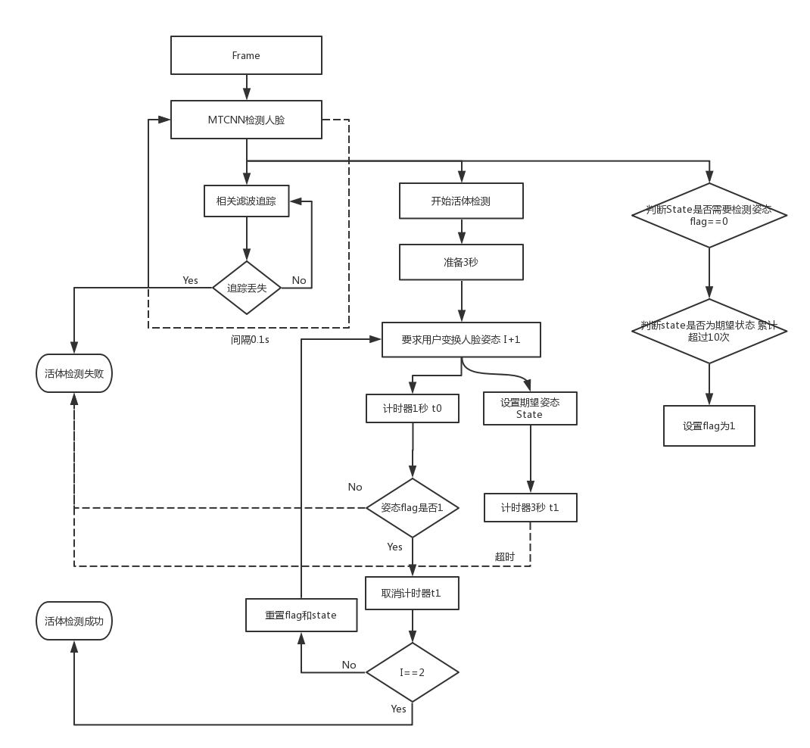

# Zeusee 人脸单目配合型活体检测 

在移动端进行人脸识别应用开发的时候，往往存在用户会使用翻拍照片录像等来欺骗人脸识别系统，因此活体检测是人脸识别和人脸验证中非常重要的一个部分，介于目前开源活体检测代码的较少，但配合型活体检测实现相对比较简单，因此我们对其做了简单的实现， 并开源了所有的代码。

### 更新

+ [基于HyperLandmark的活体检测](https://xiangzi.site/2019/04/19/iOS/%E6%B4%BB%E4%BD%93%E8%AF%86%E5%88%AB/)

+ 增加了基于IntraFace活体检测 (2018.03.30)


### 单目配合型活体检测 

由于移动端传感器的有限性，在广泛只有单目前置摄像机的情况下，非配合型的人脸活体检测实现相对比较复杂。需要的数据成本也相对较高。而配合性活体检测仅需要通过用户简单的低头摇头操作即可极大降低用户的欺骗攻击成本。

### 基本设计思路参考



###### Tips:上图有部分流程并未完全实现

### CPP 代码的使用

###### C++代码仅提供姿态检测

```c++
#include "AliveDetector.h"
int main()
{
    AliveDetector *aliveDetector = new AliveDetector(detector_path);
    while(/*<read Frame>*/){
        int state = aliveDetector->detect( Frame);
        // 检测一帧返回人脸状态
        // 检测不出人脸或人脸数超过1    -1
        // 正常                        0
        // 摇头                        1
        // 低头                        2
        // 抬头                        3
        }
    return 0;
}
```
### Android Demo

1、提供了简单的Demo工程 
2、NDK为版本为16

### 联系和交流：

关于单目非配合活体检测我们正在进行数据收集与算法开发，技术交流、捐献数据可以加入下群。
+ 交流群 724142079
+ [活体检测技术博客](http://blog.csdn.net/lsy17096535/article/details/79317452)
